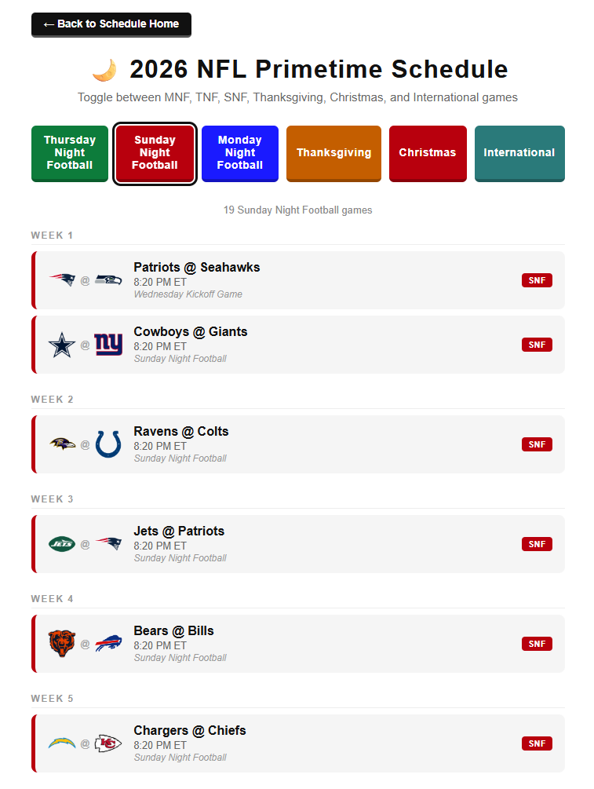

# 2026 NFL Schedule Prediction

A full 18-week NFL schedule prediction built with integer linear programming. Every game gets a week and a kickoff time — including primetime slots, international games, Thanksgiving, Black Friday, and Christmas. As the NFL officially announces games, confirmed matchups get locked in and the rest of the schedule is re-solved around them.

🔗 **Live site:** https://g3npar.github.io/nfl-schedule-maker/




---

## How it works

**Opponents** are set up manually in `src/opponents.py` based on the NFL's rotation rules. Each team plays every division opponent twice, plus cross-division and cross-conference matchups. That produces 272 total games stored in `data/games.txt`.

**Scheduling** is done with integer linear programming via [PuLP](https://coin-or.github.io/pulp/). The solver assigns each game to a week by treating it as a binary math problem — every (game, week) pair gets a 0 or 1 — then finds an assignment satisfying all the constraints. Confirmed games get pinned to their exact week and timeslot before solving.

**Kickoff times** are assigned after the weeks are set. Primetime slots (SNF, MNF, TNF) go to the best matchups based on team weights in `src/primetime_weights.py`. Special slots like Thanksgiving, Black Friday, Christmas, and international games are handled separately.

**HTML pages** are generated by `src/generate_schedules.py` — one page per team plus a primetime breakdown page. Both light and dark mode are supported.

---

## Confirmed games

As the NFL announces official games (international matchups, primetime slots, Thanksgiving, etc.), they get added to `data/confirmed_games.json`. The ILP solver locks those in and fills the rest of the schedule around them.

---

## Project structure

```
data/
  confirmed_games.json       ← locked-in confirmed matchups (week + timeslot)
  games.txt                  ← all 272 matchups
  schedule_with_times.txt    ← solver output with kickoff times
src/
  nfl_schedule_generator.py  ← ILP solver
  generate_schedules.py      ← HTML page generator
  opponents.py               ← opponent assignment logic
  primetime_weights.py       ← per-team primetime priority weights
schedules/                   ← generated team schedule pages
index.html                   ← team grid homepage
primetime.html               ← primetime games breakdown
```