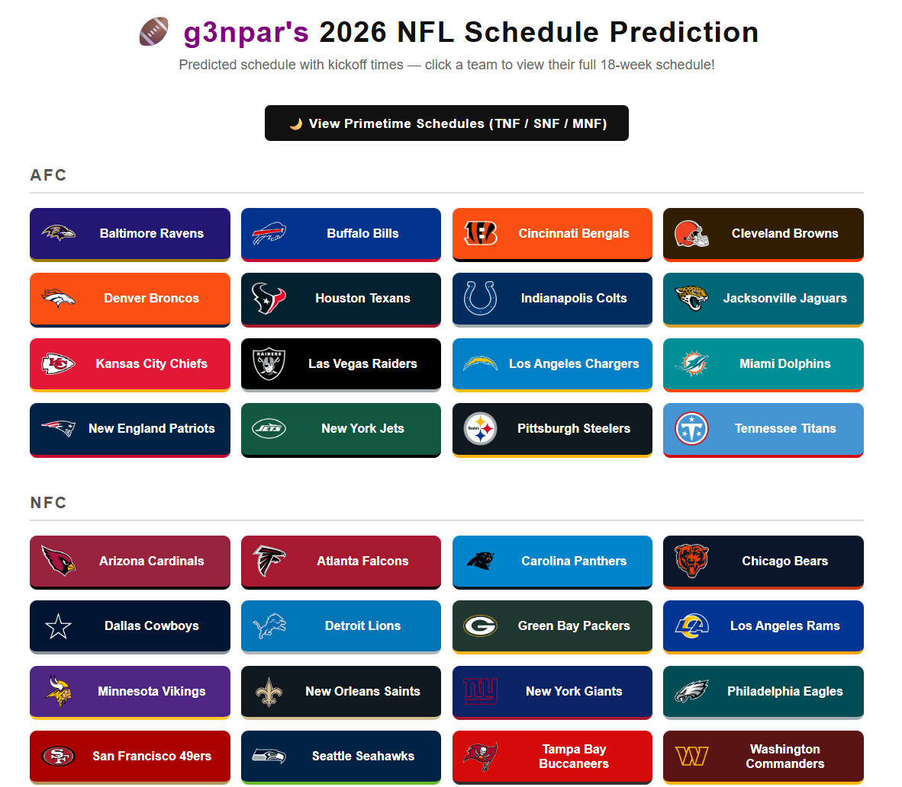
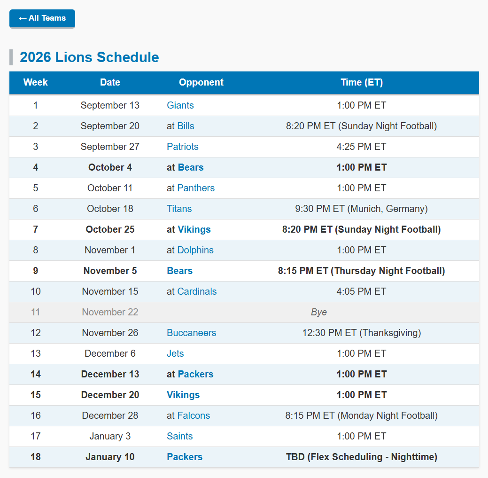

# 2026 NFL Schedule Prediction

I built this to predict what the 2026 NFL regular season schedule might look like, including which games are on primetime, which teams play internationally, and what time every game kicks off.

🔗 **Live site:** https://g3npar.github.io/nfl-schedule-maker/

---

## What is this?

This program builds a full 18-week NFL schedule from scratch. It figures out which team plays who, in which week, and at what time. Then it publishes the result as a website where you can look up any team's full schedule.

The schedule tries to feel realistic: big-market or popular teams get more primetime slots, international games go to specific venues, and no team ends up with an obviously unfair run of road games.

---

## How it works

I manually set up each team's opponents for the season in `src/opponents.py`. Every team also plays each team in their division twice (home and away). That all gets combined into a list of 272 matchups in `data/games.txt`.

This is the hard part. Scheduling 272 games across 32 teams and 18 weeks (while satisfying hundreds of constraints) is an [NP-hard problem](https://en.wikipedia.org/wiki/NP-hardness), meaning there's no efficient algorithm that can just "solve" it directly. The real NFL actually uses cloud computing to generate their schedule.

I use **integer linear programming** (ILP) via the [PuLP](https://coin-or.github.io/pulp/) library, which finds a valid solution by framing the schedule as a math problem: assign a 0 or 1 to every possible (game, week) combination, then find an assignment that satisfies all the constraints. It's not as powerful as what the NFL uses, but it gets the job done in a few minutes.

Once the weeks are set, each game gets a kickoff time. The program picks one primetime game each for Thursday, Sunday, and Monday nights, prioritizing good matchups between winning teams. It tries up to 500 different arrangements (per instance of the program) to find one where no team gets the same primetime slot two weeks in a row.

I can control how many primetime games each team gets by editing their weight in `src/primetime_weights.py` - popular teams get a higher number, rebuilding teams get a lower one.